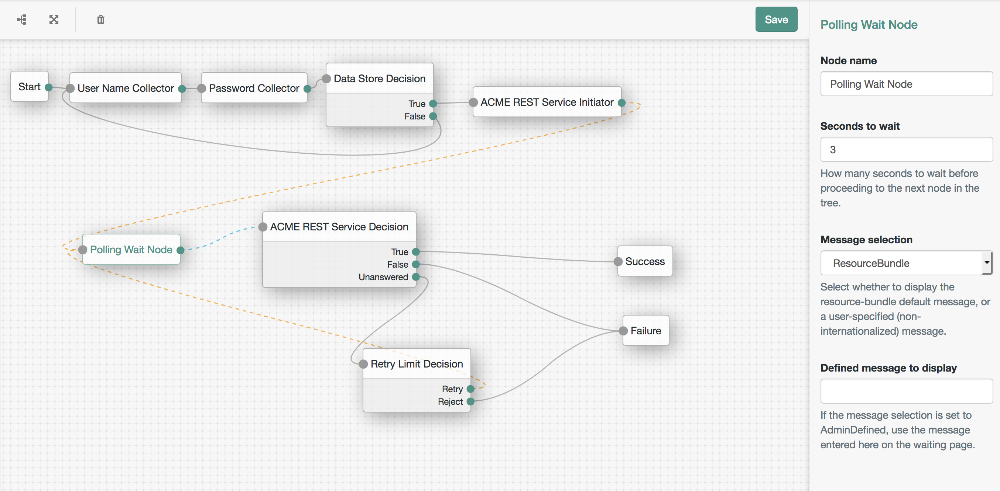
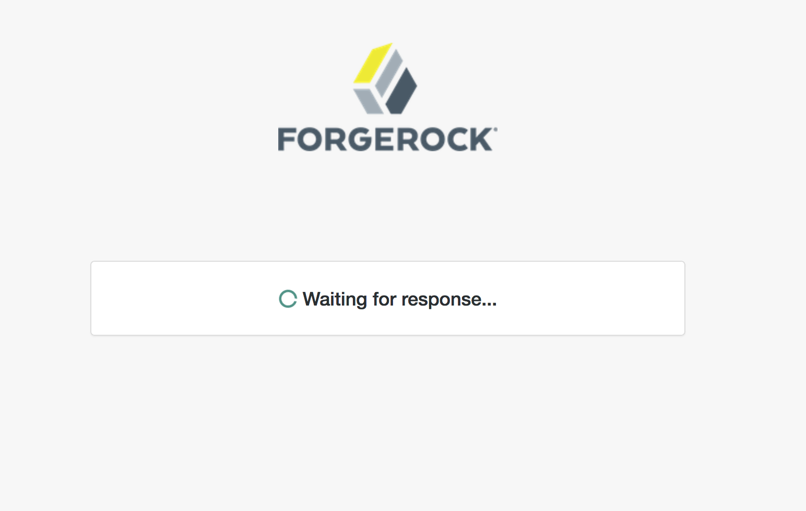

<!--
 * The contents of this file are subject to the terms of the Common Development and
 * Distribution License (the License). You may not use this file except in compliance with the
 * License.
 *
 * You can obtain a copy of the License at legal/CDDLv1.0.txt. See the License for the
 * specific language governing permission and limitations under the License.
 *
 * When distributing Covered Software, include this CDDL Header Notice in each file and include
 * the License file at legal/CDDLv1.0.txt. If applicable, add the following below the CDDL
 * Header, with the fields enclosed by brackets [] replaced by your own identifying
 * information: "Portions copyright [year] [name of copyright owner]".
 *
 * Copyright 2017 ForgeRock AS.
 * Portions copyright 2018 David Luna.
-->
# Polling Wait Node

A simple authentication node for ForgeRock's [Identity Platform][forgerock_platform] 5.5 and above. This node allows for the authentication flow to be paused for a period of time, while displaying a spinner to the user. This may be useful in the case where the authentication server requires to wait on the completion of a remote operation and wishes to poll for that success every few moments.

The authentication node will pause for a defined number of seconds, before submitting itself back to the authentication framework. The message displayed on the waiting page can be defined by the administrator, either through a static text entry field on the node, or through use of the internationalized resource bundle (an example Swedish .properties file is included). In either case, the variable _{{time}}_ may be used in the message to insert the number of seconds defined in the **seconds to wait** field.

The selection as to which is used is determined by the **message selection** choice.

* **ResourceBundle** The message will be taken from the appropriately localized resource bundle's entry, under the property name _waiting_.
* **AdminDefined** The message will be taken from admin-specified **defined message** field.

Configuration Screenshot

The above screenshot demonstrates the use of the Polling Wait Node by first requesting the user identify themselves, gathering some data from their profile and then calling out to a third-party REST service to fulfill a step of the authentication. The service operates asynchronously, and must be polled for a response. Using a Retry Limit Decision node in combination with the Polling Wait Node we can give the service a period of time to respond while displaying a user-friendly message. If the service responds successfully we break the loop and succeed, but if the service indicates failure or we get no appropriate answer from the service after a number of iterations, we fail.

Active Screenshot

## Installation

Copy the .jar file from the ../target directory into the ../web-container/webapps/openam/WEB-INF/lib directory where AM is deployed.  Restart the web container to pick up the new node.  The node will then appear in the authentication trees components palette.

## Disclaimer

The code in this repository has binary dependencies that live in the ForgeRock maven repository. Maven can be configured to authenticate to this repository by following the following [ForgeRock Knowledge Base Article](https://backstage.forgerock.com/knowledge/kb/article/a74096897).
        
The sample code described herein is provided on an "as is" basis, without warranty of any kind, to the fullest extent permitted by law. ForgeRock does not warrant or guarantee the individual success developers may have in implementing the sample code on their development platforms or in production configurations.

ForgeRock does not warrant, guarantee or make any representations regarding the use, results of use, accuracy, timeliness or completeness of any data or information relating to the sample code. ForgeRock disclaims all warranties, expressed or implied, and in particular, disclaims all warranties of merchantability, and warranties related to the code, or any service or software related thereto.

ForgeRock shall not be liable for any direct, indirect or consequential damages or costs of any type arising out of any action taken by you or others related to the sample code.

[forgerock_platform]: https://www.forgerock.com/platform/  
